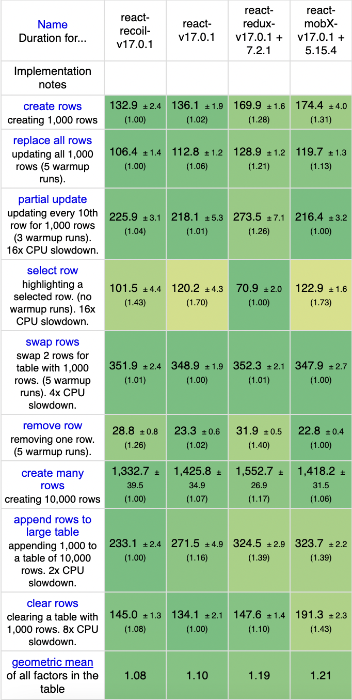

# React State Management Libraries Comparion

|                     | Built-in                                                                                                                              | Redux                                                                                                                                                                                                      | MobX                                                                                                                                                                                                                      | Recoil                                                                                                                                                                                                                                                                                                                                                                                          |
| ------------------- | ------------------------------------------------------------------------------------------------------------------------------------- | ---------------------------------------------------------------------------------------------------------------------------------------------------------------------------------------------------------- | ------------------------------------------------------------------------------------------------------------------------------------------------------------------------------------------------------------------------- | ----------------------------------------------------------------------------------------------------------------------------------------------------------------------------------------------------------------------------------------------------------------------------------------------------------------------------------------------------------------------------------------------- |
| Git Stars           | 176k                                                                                                                                  | 21k                                                                                                                                                                                                        | 24k                                                                                                                                                                                                                       | 15k                                                                                                                                                                                                                                                                                                                                                                                             |
| Weekly Downloads    | 12M                                                                                                                                   | 5M                                                                                                                                                                                                         | 525k                                                                                                                                                                                                                      | 130k                                                                                                                                                                                                                                                                                                                                                                                            |
| Unpacked Size       | 291kB                                                                                                                                 | 450kb                                                                                                                                                                                                      | 3.4mb                                                                                                                                                                                                                     | 1.66mb                                                                                                                                                                                                                                                                                                                                                                                          |
| Is Production Ready | Yes                                                                                                                                   | Yes                                                                                                                                                                                                        | Yes                                                                                                                                                                                                                       | experimental library, very few cases in production                                                                                                                                                                                                                                                                                                                                              |
| Ecosystem           | Huge Ecosystem                                                                                                                        | Giant [ecosystem](https://redux.js.org/introduction/ecosystem) of helpful add-ons, libraries, and tools                                                                                                    | Big [ecosystem](https://github.com/xgrommx/mobx-ecosystem) available for MobX                                                                                                                                             | There is no ecosystem for Recoil at the moment                                                                                                                                                                                                                                                                                                                                                  |
| Testability         | Testing custom hooks may be a challenge. There is `@testing-library/react-hooks` library that help write tests for complicated cases; | Redux consists of pure functions (actions and reducers), making it great for unit testing. It also provides the mechanism to write integration tests where the store, actions, and reducers work together. | Observable stores are plain JavaScript objects with reactive functionality hidden inside. Testing is the same as for any other JavaScript class                                                                           | Recoil provides a mechanism for testing its atoms and selectors.                                                                                                                                                                                                                                                                                                                                |
| Maintainability     | Maintained by Facebook                                                                                                                | Biggest support of comunity and developers compare to all state libraries                                                                                                                                  | Big support of comunity and developers                                                                                                                                                                                    | Least support compare to other state management libraries                                                                                                                                                                                                                                                                                                                                       |
| Core Concepts       | Built-in Hooks for local state management; Context API for sharing data across different parts of app avoiding prop drilling          | Global state; changes in state occur using atomic actions that are dispatched to the reducer. Depending on the action type, the reducer updates the state in an immutable way.                             | Separate observable stores to witch components subscribe to access the state, calculated values, and actions. Mobx creates internal graph, tracks property access and updates all components that haav updated properties | Built on top of two terms: atom and selector. An atom is a shared-state piece. A component can subscribe to an atom to get/set its value. Only the subscribed components are re-rendered when the value is changed. Selector is a value aggregated from an atom or other selector.Whenever an atom/selector is changed, the selectors that use it (i.e., are subscribed to it) are reevaluated. |

### Benchmarks

The following operations are benchmarked for each framework:

- Duration in milliseonds.
- Compare: green means significantly faster, red significantly slower.
- create rows: Duration for creating 1,000 rows after the page loaded (no warmup).
- replace all rows: Duration for replacing all 1,000 rows of the table (with 5 warmup iterations).
- partial update: Time to update the text of every 10th row for a table with 10,000 rows (with 5 warmup iterations).
- select row: Duration to highlight a row in response to a click on the row. (with 5 warmup iterations).
- swap rows: Time to swap 2 rows on a table with 1,000 rows. (with 5 warmup iterations).
- remove row: Duration to remove a row for a table with 1,000 rows. (with 5 warmup iterations).
- create many rows: Duration to create 10,000 rows (no warmup)
- append rows to large table: Duration for adding 1,000 rows on a table of 10,000 rows (no warmup).
- clear rows: Duration to clear the table filled with 10,000 rows. (no warmup)

Preferred state management library: Redux with RTK.

Pros:

- Predictable state and way of change;
- Tools for debugging (redux dev tool extention);
- Has internall performance optimizations;
- Great community support and developer maintenance;
- High performace in different scale applications;
- Easy testing;
- Huge Ecosystem;

Cons:

- Boilerplate code - resolve with using RTK;
- learning curve and adaptation to mental model of Redux;
- overkill for small projects;
