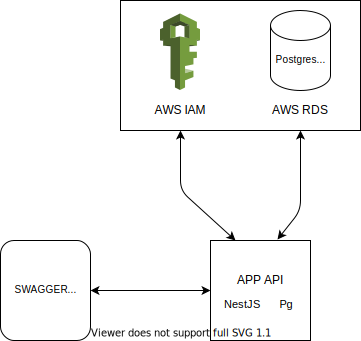

## Description

### Obj-factory-v1
Greenfield application with basic CRUD operations working with one atomic entity object, implemented with NestJS framework, connection to remote PostgreSQL DB via AWS RDS. Uses pg package for db communication.

### For installation and running app and tests use root README.md file
#### Local SWAGGER UI:

```bash
http://localhost:3000/api/docs
```

### Create locally objects table in postgresQL:

```bash
$ psql -d <dbname> -U <username> -a -f ./create-table.sql
```

### config.json file

To connect application to local PostgreSQL DB create config.json file in root directory of obj-factory-v1 app with parameters:
```
{
    "PG_CONFIG": {
       "DATABASE_HOST": <db_host>,
       "DATABASE_PORT": <db_port>,
       "DATABASE_USERNAME": <db_username>,
       "DATABASE_PASSWORD": <db_password>,
       "DATABASE_NAME": <db_name>,
       "DATABASE_SYNCHRONIZE": <db_synchronize> (true/false)
    },
    "APP_PORT": <app_port>
}
```
- APP_PORT - the port on which the application is running - optional, default 3000

### To connect application to RDS use AWS credentials in config.json as shown above.

### Tests
To run e2e tests create local postgres DB and connect to it using .env file
and then run command from root directory:

```bash
$ yarn run test:e2e:obj-factory-v1
```

### Architecture diagram


